#### Zebra-Priner_Zebra-Designer-3-Pro-Get-Started
# Zebra Designer 3 Pro初心者ガイド

Zebra社が提供するラベル作成ソフトウェア ZebraDesigner Pro 3 について、まずどこから始めたらいいかで悩まれている方向けに作成したガイドとなります。

## 0. 本手順で必要なマテリアル

1. Zebra Link-OS プリンタ
1. 印刷用のラベル・リボン
1. Window PC 
   PCの要件は[ZDesigner3ソフトウェアサポート](https://www.zebra.com/jp/ja/support-downloads/software/printer-software/zebra-designer-3-downloads.html?downloadId=0e435efd-2df7-4c0e-a48d-3ab309bb62db#Ta-item-20de78b3f2-tab)の「要件」を参照。
1. PC <--> プリンタ接続用のUSBケーブル

## 1. ドライバのインストール

1. インストーラのダウンロード

   - ご利用のプリンタのサポートページからドライバをダウンロードする。
   - v10をダウンロードすること。

1. ドライバのインストール
    ダウンロードしたファイルを解凍→実行。

1. 下記手順に従いv10以外のドライバを削除する
    [ZPLプリンタをv10のドライバで自動認識させる方法（v5ドライバを削除する方法）](https://github.com/shimauma-giken/Zebra-Printer_Erase-Zebra-Designer-3-v5-Driver-from-Laptop)
        

## 2. プリンタとサプライのセットアップ

各プリンタのユーザーズガイドに従い、用紙のセットアップをする。

## 3. ZDeginer3のインストール 

1. Zebra Deigner 3 Proをダウンロードする。
   https://www.zebra.com/jp/ja/support-downloads/software/printer-software/zebra-designer-3-downloads.html

1. ダウンロードしたファイルを実行してソフトウェアをインストール。

## 4. ZDeginer3の起動と新規ラベルデザインの作成 

1. WinスタートメニューからZebra Designer 3を起動する

1. **新規ラベルを作成** を選択。ウィザードに従いラベル設定をする。

<table border="1" cellspacing="0" cellpadding="8" style="text-align: center; width: 100%;">
  <thead>
    <tr>
      <th width="420">
      1. プリンタを選択
      </th>
      <th width="420">
      2. ページの選択
      </th>
      <th width="420">
      3. ラベルレイアウトの選択
      </th>
    </tr>
  </thead>
  <tbody>
    <tr>
      <td>
      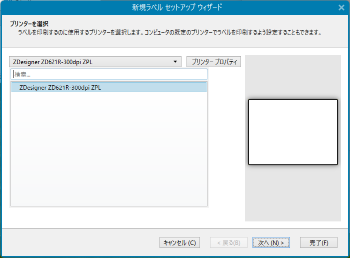
      </td>
      <td>
      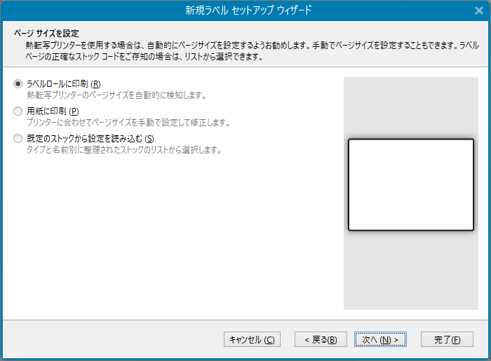
      </td>
      <td>
      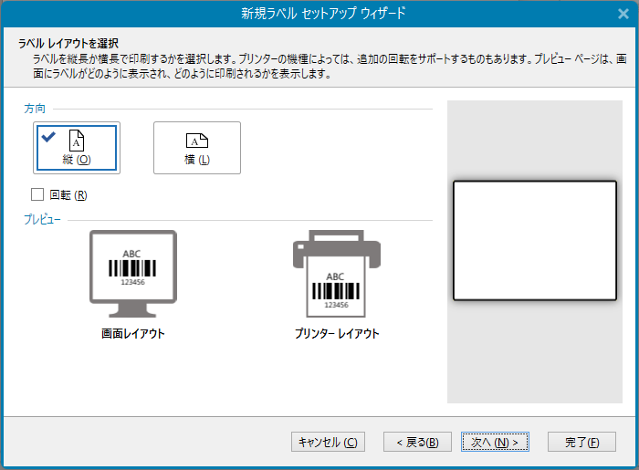
      </td>
    </tr>
    <tr>
      <td>
      ・プリンタの選択
      </td>
      <td>
      ・用紙の選択
      </td>
      <td>
      ・印刷の向き
      </td>
    </tr>
  </tbody>
</table>

<table border="1" cellspacing="0" cellpadding="8" style="text-align: center; width: 100%;">
  <thead>
    <tr>
      <th width="420">
      4. ラベルサイズを指定
      </th>
      <th width="420">
      5. 設定概要
      </th>
    </tr>
  </thead>
  <tbody>
    <tr>
      <td>
      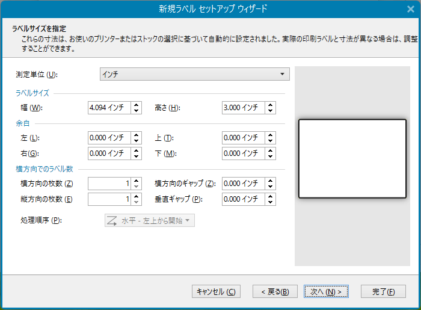
      </td>
      <td>
      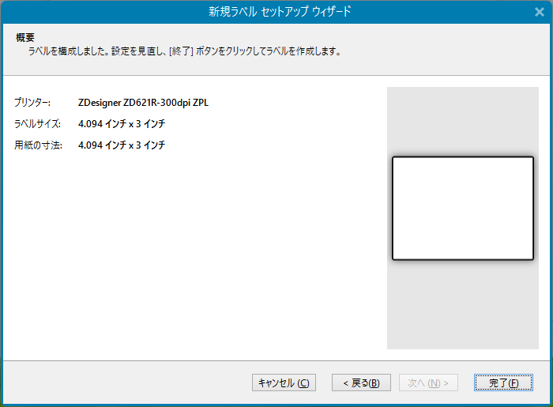
      </td>
    </tr>
    <tr>
      <td>
      ・測定単位 
      ・ラベルサイズ 
      ・余白
      </td>
      <td>
      ・用紙の選択
      </td>
    </tr>
  </tbody>
</table> 

aaa

## 4. プリンタのプロパティの設定

1. ラベル・プリンタ構成に合わせて、ドライバの設定する。
   **ドキュメントのプロパティ** --> **プリンタのプロパティ**

    <table border="1" cellspacing="0" cellpadding="8" style="text-align: center; width: 100%;">
    <thead>
        <tr>
        <th width="420">
            ページ設定
        </th>
        <th width="420">
        印刷オプション
        </th>
        <th width="420">
        動作モード
        </th>
        </tr>
    </thead>
    <tbody>
        <tr>
        <td>
        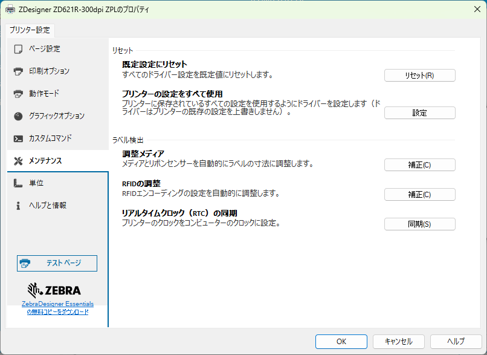
        </td>
        <td>
        
        </td>
        <td>
        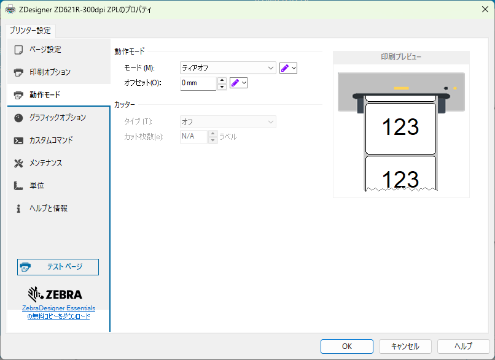
        </td>
        </tr>
        <tr>
        <td>
        ・幅・高さ 
        ・センサー 
        ・回転
        </td>
        <td>
        ・速度・濃度 
        ・印刷方式 
        ・印字起点補正
        </td>
        <td>
        ・モード 
        ・オフセット 
        ・カッター
        </td>
        </tr>
    </tbody>
    </table>

1. **(ワンポイント)** 「メンテナンス」で簡易なプリンタ設定・印刷テストができる。
    

    |ボタン| 説明 |
    |:-|:-|
    | プリンタの設定を～  | プリンタの設定を優先して使用。ドライバの設定は無視。
    | 調整メディア  | 用紙のキャリブレーションを実施。
    | RFIDの調整  | RFIDのキャリブレーションを実施。
    | テストページ  | 現在の設定で、テストラベルを印刷。

## 5. ユーザー視点で押さえておくべき基本機能 

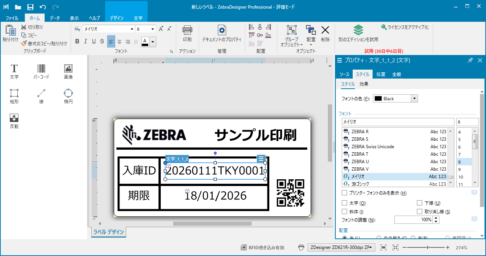

- **テキストとバーコードの配置**
  - フォント選択（内蔵フォント vs Windowsフォント）
- **グラフィックの挿入**
  - ロゴ等の画像データの最適化
- **位置合わせツール**
  - 整列、グループ化、スナップ機能の活用

     

    **(ワンポイント)** 
    プリンタのフォントを使用する場合は下記リンクを参照。

    [Zebra Designer 3でプリンタ内蔵の日本語フォントを利用する方法](https://github.com/shimauma-giken/Zebra-Printer-Add-Japanese-Font-to-Windows-Driver-to-Utilize-in-Zebra-Designer)

### 5-1. Let's Play 1 - 基本

下記デザインのラベルを作成して印刷をしてみよう。

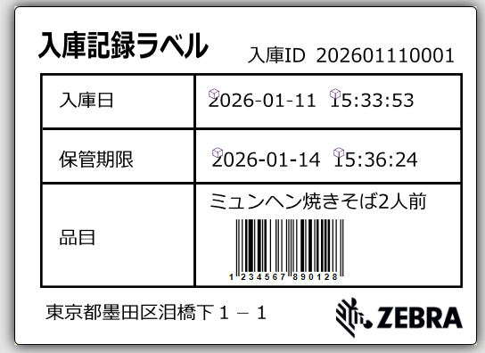

|オブジェクト|カテゴリ|データ|
|-|-|-|
|罫線|四角・線で作成|
|入庫ID|テキスト・固定| 文字列|
|入庫日 |テキスト・固定| YYYY-MM-DD HH:MM:DD|
|保管期限|テキスト・固定| YYYY-MM-DD HH:MM:DD|
|品目|テキスト・固定| 品目名とJANコード|
|企業ロゴ|画像| |

### 5-1. Let's Play 2 - 応用

下記デザインのラベルを作成して**ラベルを5枚**印刷をしてみよう。

|オブジェクト|カテゴリ|データ|
|-|-|-|
|罫線|四角・線で作成|
|入庫ID|テキスト・結合| YYYYMMDD + 連番|
|入庫日 |テキスト・現在時刻| YYYY-MM-DD HH:MM:DD|
|保管期限|テキスト・現在より3日後の日時| YYYY-MM-DD HH:MM:DD|
|品目|テキスト・固定| 品目名とJANコード|
|企業ロゴ|画像| |

## 6. 実際の運用シーンを想定したラベル作成体験 

 **ワーク内容：現品票ラベルの作成**
 - Excelデータとの接続（データベースウィザードの利用)
 - Excel/Access/csv/ODBC DBが利用可能

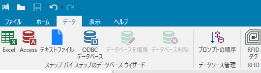

### 5-1. Let's Play 3 - 基本

下記データを棚札として印刷するサンプルを作成しよう。

#### データサンプル
| ブランド   | 商品名                   | 本体価格 | 税込み価格 | バーコード       |
|------------|--------------------------|----------|------------|------------------|
| シマシマ印 | ミュンヘンたこ焼き       | 500      | 540        | 123456789012     |
| 寅嶋社     | 骨付き豆腐バーグ         | 600      | 648        | 123456789013     |
| ZBR社      | ラード、カロリーハーフ   | 700      | 756        | 123456789014     |

#### ラベルイメージサンプル
 
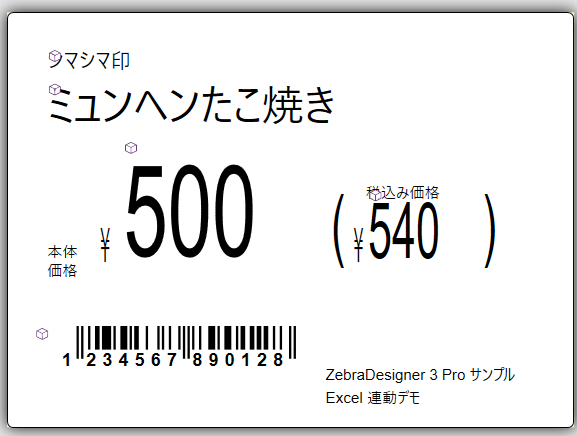

|オブジェクト|カテゴリ|データ例|
|-|-|-|
|ブランド|テキスト| シマシマ印
|商品名|テキスト| ミュンヘンたこ焼き|
|本体価格 |テキスト| 500|
|税込み価格|テキスト| 540|
|バーコード|テキスト| 123456789012|

---

# Section 3
## 営業・運用のプロ技 ★

---

## 7. 純正ソフトだからできる「裏技」伝授 ★

- **プリンタフォントの活用**
  - 印刷速度を極限まで高める設定方法
- ****
  - 画像をプリンタメモリに保存し、通信負荷を軽減
- **直接コマンドの挿入**
  - ZPLコードをデザインの一部として埋め込む

---

## 8. 鉄板の営業デモ手法 ★

- **「その場で作成」デモのインパクト**
  - 顧客の目の前でロゴとバーコードを入れたラベルを3分で作る
- **Excel連携の魔法**
  - 「今の管理表がそのままラベルになります」という訴求
- **解決策の提示**
  - 顧客の現在の「困りごとラベル」を再現し、改善点を提案

---

## 9. よくある初期トラブルと即効対処法 ★

- **ケース1：印字がずれる**
  - センサー設定（透過 vs 反射）の確認
- **ケース2：バーコードが読み取れない**
  - バーの太さ（モジュール幅）と印字密度の関係
- **ケース3：ソフトがプリンタを認識しない**
  - 双方向通信設定とスプーラーの確認

---

## まとめ・質疑応答

- Zebra Designer 3 Pro は「単